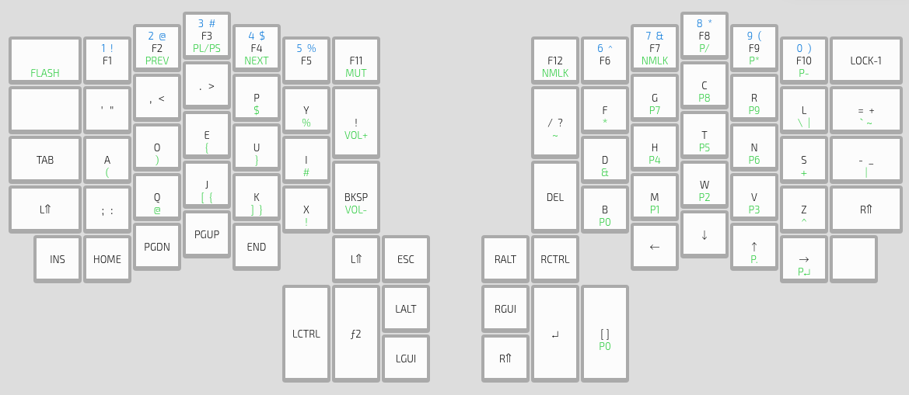

Ergo
====

Ergo is a keyboard layout that is primarily built for use on an ErgoDox
keyboard, and should be easily adaptable to a more normal keyboard.

Ergo is loosely based off of Neo, in that it moves all numbers and symbols onto
a different layer which should decrease finger travel.


```
base
   F1F2F3F4F5 F11     F12 F6F7F8F9F10
    ' , . p y !         / f g c r l =
tab a o e u i             d h t n s -
LSh ; q j k x bsp     del b m w v z RSh

L1
    ' , . $ %           ~ * 7 8 9 \ `
    ( ) { } #             & 4 5 6 + |
    ; @ [ ] !             0 1 2 3 ^ 
```

## Layout


